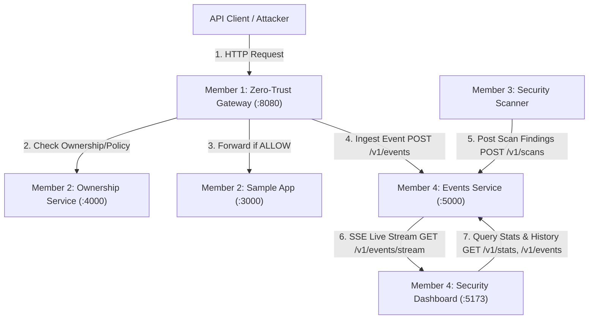

# ZeroTrustAPI System Architecture (Member 4)

## Overview

The **ZeroTrustAPI** architecture delivers zero-trust runtime authorization and telemetry observability across multi-tenant API microservices.

---

## Role Separation & Member Boundaries

| Member | Subsystem | Responsibility | Port |
| :--- | :--- | :--- | :--- |
| **Member 1** | `/gateway` | Reverse proxy, token extraction, zero-trust policy enforcement, authorization decision (ALLOW/BLOCK) | `8080` |
| **Member 2** | `/ownership`, `/sample-app` | Tenant ownership registry, multi-tenant resource fixtures, target business application | `4000`, `3000` |
| **Member 3** | `/scanner` | Automated BOLA/IDOR vulnerability scan runner, test case execution | CLI / Cron |
| **Member 4** | `/events`, `/dashboard`, `/benchmark`, `/docs` | Telemetry ingestion, real-time SSE event bus, live SOC dashboard, load testing, system docs | `5000`, `5173` |

---

## Events Service Architecture (`/events`)

The Events Service is organized following clean layered architecture:

- **Routes (`src/routes/`)**: Expose frozen HTTP endpoints.
- **Controllers (`src/controllers/`)**: Request parsing, Zod validation, HTTP status mapping.
- **Services (`src/services/`)**:
  - `event.service.ts`: Event validation, anonymization privacy enforcement, storage, SSE broadcast.
  - `scan.service.ts`: Vulnerability finding aggregation and reporting.
  - `stats.service.ts`: Real-time calculation of block rate, velocity, and tenant distribution.
  - `sse.service.ts`: Client connection lifecycle, keepalive heartbeats, auto-cleanup on disconnect.
  - `mock.service.ts`: Standalone simulated telemetry engine for offline development and demo mode (`MOCK_DATA=true`).
- **Storage (`src/storage/`)**:
  - `IEventStore` & `InMemoryEventStore`: Decoupled in-memory storage buffer with capacity management.
  - `IScanStore` & `InMemoryScanStore`: Scan report storage.
- **Privacy Layer (`src/utils/privacy.ts`)**: Enforces zero-exposure of raw user IDs, raw object IDs, JWTs, Authorization headers, or request bodies.

---

## Data Flow & SSE Telemetry

1. When Member 1 Gateway evaluates a request, it emits an anonymized `SecurityEvent` to `POST /v1/events`.
2. The Events Service validates schema and privacy invariants.
3. The event is stored in `InMemoryEventStore`.
4. `SSEService` broadcasts the event payload via `text/event-stream` to all connected browser clients on the Dashboard.
5. The Dashboard UI updates live without page refreshes.
